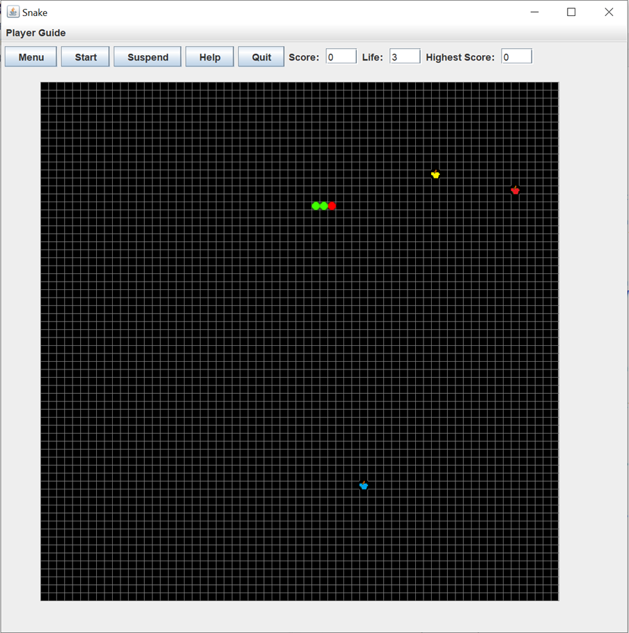
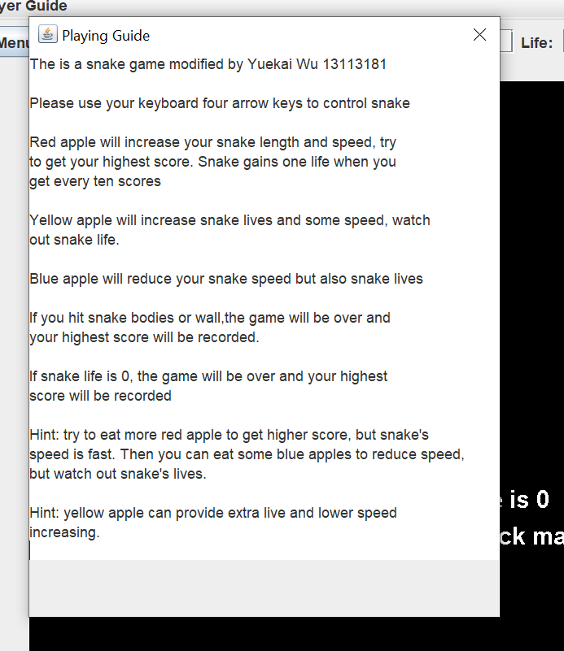
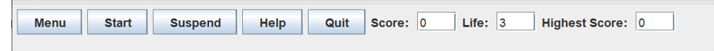
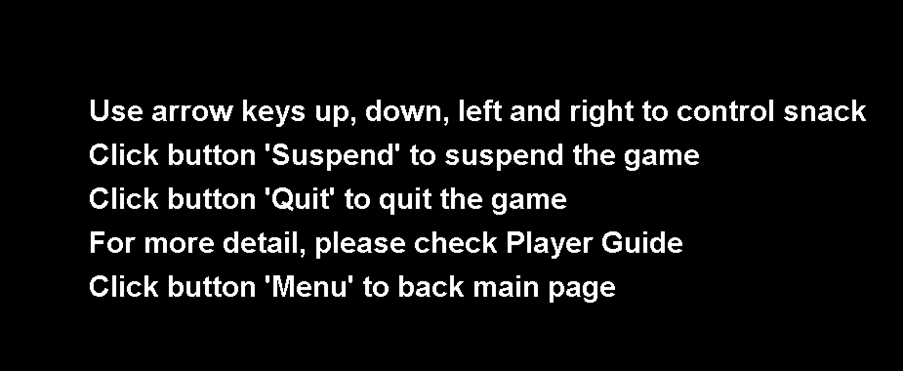
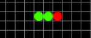

# Snake

This is my first snake game. In this post, I will introduce some of my ideas and how I implemented them.

Figure 1 shows the main page of the game:

(Figure 1)

Figure 2 shows a single dialog that displays the game's playing guide when the user clicks on a button in the menu bar. The user can read it to understand the game's rules and get some hints on how to achieve higher scores.

(Figure 2)

These five buttons and text fields are user-oriented, making it easy for users to control them when playing the game (see Figure 3).

 (Figure 3)

Figure 4 shows the main page that users see when they open or restart the game. They can start the game by clicking the 'Start' button, which will display the window shown in Figure 1.

(Figure 4)

If users want to temporarily stop playing the game, they can click the 'Suspend' button, which will pause the game. To resume the game, they simply click the button again. When the game is suspended, a message will be displayed on the screen, as shown in Figure 5.

(Figure 5)

If users need some help playing the game, they can click the 'Help' button, which will display some short messages that introduce them to the basic rules and functions of the game (see Figure 6). To close the game, users can click the 'Quit' button.

(Figure 6)

The score field records the current score earned by the player, while the life field shows the number of lives remaining for the snake. The highest score field displays the highest score achieved in the player's history of playing the game.

During the game, I implemented three types of apples with different properties:

Red apples: they provide one score and grant an extra life to the snake every time ten scores are achieved. They also increase the snake's speed.

Yellow apples: they grant an extra life to the snake and increase its speed.

Blue apples: they decrease the snake's life but also reduce its speed.

The program draws the snake with red and green dots, where the red dot represents the head and the green dots represent the body. (See Figure 7).

(Figure 7)

